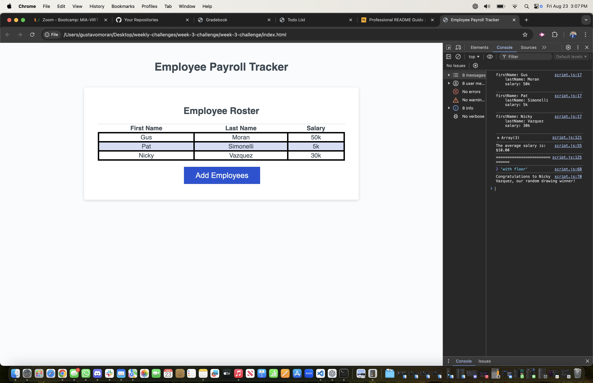

# Week 3 Challenge

## Usage

Below is a screenshot of the working employee tracker with links to the github and URL to the live site:

<a href="https://github.com/gus7770/week-3-challenge"> Github Repo </a>

<a href="https://gus7770.github.io/week-3-challenge/"> Live Page</a>

    

  

## Credits

Sample Code : from UM Bootcamp
Debugger : Gustavo Moran

## License

## Features

Here is a list of working features for the employee tracker:
*Collects employee data after entered and will display in chronological order. This will also be entered in the console log
*Will display the average salary of the employees in the console log
*The console log will generate a random employee from the list entered to generate a winner
